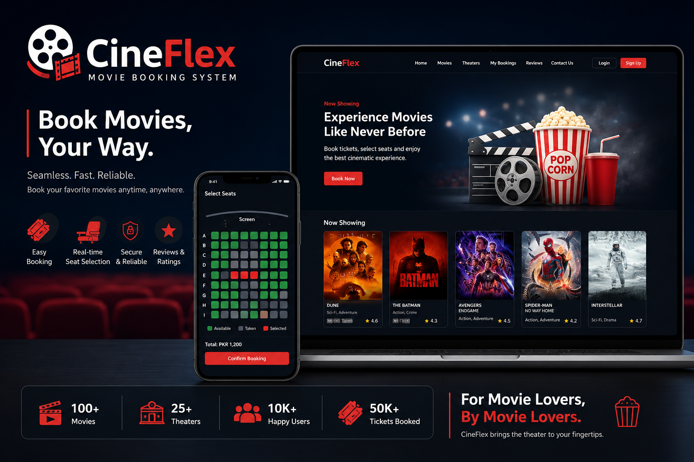

# 🎬 CineFlex – Movie Booking System

  

  A Full-Stack Movie Booking System built with PHP, MySQL, HTML, CSS, JavaScript, and Bootstrap.

---

## 📖 Overview

CineFlex is a web-based Movie Booking System designed to replace traditional cinema ticket booking methods with a fast, secure, and user-friendly online platform.

The system allows customers to browse movies, view show timings, select seats, book tickets, and submit reviews. Administrators can manage movies, theaters, shows, users, bookings, and reviews through a centralized dashboard.

---

## 🎯 Project Objectives

- Provide online movie ticket booking
- Eliminate manual booking conflicts
- Enable real-time seat management
- Implement role-based authentication
- Maintain booking history
- Allow movie ratings and reviews
- Centralize cinema management operations

---

## ✨ Features

### 👤 Customer Features

- User Registration & Login
- Browse Movies
- View Movie Details
- Check Show Timings
- Interactive Seat Selection
- Online Ticket Booking
- Booking History
- Submit Reviews & Ratings
- Contact Us Page
- Responsive User Interface

### 🛡️ Admin Features

- Admin Dashboard
- Manage Movies (CRUD)
- Manage Theaters
- Manage Shows
- Manage Users
- Manage Bookings
- Update Payment Status
- Moderate Reviews
- View Contact Messages

---

## 🏗️ System Modules

### 1. User Module

Handles:

- Registration
- Login / Logout
- Session Management
- Profile Access
- Booking History

### 2. Booking Module

Handles:

- Show Selection
- Seat Selection
- Booking Confirmation
- Payment Status
- Seat Availability Validation

### 3. Admin Module

Handles:

- Movie Management
- Theater Management
- Show Scheduling
- User Management
- Booking Management

### 4. Review Module

Handles:

- Movie Ratings
- User Reviews
- Review Moderation

---

## 🛠 Technology Stack

| Layer | Technology |
|---------|------------|
| Frontend | HTML5, CSS3, JavaScript |
| UI Framework | Bootstrap 5 |
| Backend | PHP 8.x |
| Database | MySQL 8.x |
| Local Server | XAMPP / Apache |
| IDE | Visual Studio Code |

---

## 🗄 Database Design

The database follows relational design principles and normalization (3NF).

### Tables

| Table | Description |
|---------|------------|
| users | Stores customer and admin accounts |
| movies | Stores movie details |
| theaters | Stores theater information |
| shows | Stores movie show schedules |
| bookings | Stores ticket reservations |
| reviews | Stores ratings and reviews |
| movie_cast | Stores cast information |
| contact_messages | Stores contact form submissions |

### Key Relationships

- One User → Many Bookings
- One User → Many Reviews
- One Movie → Many Reviews
- One Movie → Many Shows
- One Theater → Many Shows
- One Show → Many Bookings
- One Movie → Many Cast Members

### Database Features

- Primary Keys
- Foreign Keys
- ON DELETE CASCADE
- Normalized Schema (3NF)
- Referential Integrity

---

## 🔐 User Roles

### Customer

- Browse movies
- Book tickets
- Review movies
- View booking history

### Administrator

- Manage movies
- Manage theaters
- Manage shows
- Manage bookings
- Manage users
- Manage reviews

---

## 📊 Development Methodology

The project was developed using a modular approach:

1. Requirements Analysis
2. Database Design
3. Frontend Development
4. Backend Development
5. CRUD Implementation
6. Integration & Testing
7. Documentation

---

## 🧪 Testing

The system was tested for:

- User Authentication
- CRUD Operations
- Seat Booking Logic
- Review Submission
- Foreign Key Constraints
- Admin Operations
- Responsive Design

---
